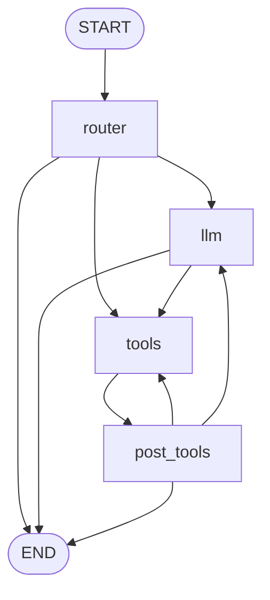

# AI Scheduling Assistant

This project is a full-stack AI scheduling assistant for a small music studio. It combines a FastAPI + Postgres/pgvector backend with a Next.js frontend and a LangGraph agent that can propose, book, and manage appointments, handle credit wallets, and draft emails, while keeping a human owner in control.

## Overview
- Full‑stack AI scheduling assistant for a small music studio business.
- Backend: FastAPI (appointments, availability, wallets, admin fees, email drafts, AI agent).
- Frontend: Next.js App Router (owner dashboard, client portal, agent chat, email approval).
- Live frontend: https://music-studio-rho.vercel.app (Vercel).
- Demo login (owner): email `owner@example.com`, password `demo-pass-123`.

## What it does
- Owner scheduling: availability rules, special openings, time off, conflict-aware booking/rescheduling/cancel flows.
- Payments and wallets: credit bundles, wallet auto-apply to appointments/admin fees, refunds logic.
- AI agent: LangGraph toolchain for slot finding, booking, pricing, wallet ops, analytics, and email drafting with approval gates.
- Email workflows: agent drafts → owner approves via Outbox; SMTP-enabled sending in production.
- Safety/reliability: JWT auth, prompt-injection guard, SSE error events, per-owner rate limiting (per-instance memory), UUID validation on chat sessions.

## Repo Layout
- /backend — FastAPI service, Alembic migrations, agent toolchain.
- /my-app — Next.js (NextAuth, Prisma for auth DB, proxy to backend).
- /docker-compose.yml — local Postgres (pgvector) + Adminer.

Prerequisites
- Python 3.11+
- Node 18+
- Postgres 14+ with pgvector (local via Docker recommended).

## Quickstart (Local Dev)
1) Database (from repo root): 'docker compose up -d db'
2) Backend setup:
   - Copy /backend/.env.example → /backend/.env and edit.
   - In dev you may set AUTH_DISABLED=1 and DEV_FAKE_OWNER_ID.
   - From /backend: alembic upgrade head
   - Start API: uvicorn main:app --reload
3) Frontend setup:
   - Edit /my-app/.env.local:
     - NEXTAUTH_SECRET (must match backend)
     - NEXTAUTH_URL (e.g., http://localhost:3000)
     - BACKEND_URL (e.g., http://localhost:8000)
     - FRONTEND_DATABASE_URL (Postgres DSN for NextAuth)
   - From /my-app: npm install && npm run dev
4) Open http://localhost:3000 and sign in. Owner dashboard exposes agent chat and admin panels.

Key Concepts
- Auth: NextAuth (credentials or Google). Frontend signs a short‑lived HS256 JWT with 'NEXTAUTH_SECRET' and proxies API calls to the backend.
- CORS: Backend must allow the frontend origin. In production, restrict to Vercel domain.
- SSE: Agent chat uses stream responses; ensure proxies/load balancers support streaming.

## Key env vars (backend)
- Database: `BACKEND_DATABASE_URL`, `RUN_DB_MIGRATIONS`.
- Auth: `AUTH_DISABLED` (dev only), `DEV_FAKE_OWNER_ID` (dev only), `NEXTAUTH_SECRET`.
- Models: `AGENT_MODEL`, `OPENAI_MODEL`, `OPENAI_API_KEY`.
- CORS: `CORS_ALLOWED_ORIGINS`.
- Error detail: `DEV_ERROR_DETAILS` (default 0; flip to 1 only when debugging locally).
- Rate limiting: `RATE_LIMIT_CHAT_PER_MIN`, optional `RATE_LIMIT_REDIS_URL` (leave unset for demo; per-instance memory).
- Email: `SMTP_HOST`, `SMTP_PORT`, `SMTP_USER`, `SMTP_PASS`, `MAIL_FROM`, `ALLOW_AGENT_DIRECT_EMAIL` (keep 0 to require approval).
- Debug: `DEBUG_ENDPOINTS`, `DEV_DEBUG_TOKEN`, `CHAT_THREAD_TTL_DAYS`.

## Demo data seeding 
- Seed script: `cd backend && python scripts/seed_demo.py`
  - Creates an owner (`owner-demo-1`), a client (`client-demo-1`), one client account/person/email, a special opening (next Friday 9–12 local), and a time-off block (next Wednesday 13–15 local).
  - Idempotent; safe to rerun.
- Customizable IDs/emails inside `backend/scripts/seed_demo.py`.

## Testing
- Backend tests live in `backend/tests`. Example: `cd backend && pytest tests/test_agent_chat.py tests/test_services/test_wallets.py`.
- Chat tests cover UUID validation and rate limiting; wallet tests cover auto-apply flows.
- Health (local): `curl -s http://localhost:8000/healthz` should return `{"status":"ok"}`

## Demo scripts
- “Book client tomorrow at 10am for 60 minutes” → find slots → book_appointment → confirmation.
- “Block off next Friday from 9am to 5pm” → add_time_off → calendar updates.
- “What does client owe me?” → financial dashboard / payments summary.
- “Draft an email to Sam saying I’ll be 10 minutes late” → UI:EMAIL_DRAFT card, then approve/send from Outbox.

## Future work
- Global rate limiting with Redis/Upstash so limits hold across scaled Cloud Run instances.
- Sandbox SMTP (e.g., Mailtrap) for safe outbound email demos.
- Richer seeded data: past/future appointments, payments, wallet movements to showcase dashboards.
- Observability: structured logs + basic traces/metrics for easier debugging.
- Optional OAuth (Google) to show a smoother demo login alongside the seeded owner.
- Enhancing usability, booking logic, llm bugs, and user experience for specific use cases. 

# Agent overview

## Request flow (agent_chat.py, graph.py, build.py): 
1. Frontend sends user text -> GET /api/agent/chat
2. agent_chat.py build a LangChain config with relevant metadata (thread_id, user_id, owner_id, timezone, checkpoint_ns)
3. Graph starts at router: 
  - Routes clear intents, can emit tool calls or claritying questions. 
  - If no route matches -> llm with system prompt
4. Llm call model bound with tools, and executes tools at the model's request. 
5. Post_tools reads tool results and can emit confirmations, request additionsl tools, or emit UI markers for the front end. 
6. Streamed SSE events include assistant deltas and any UI markers. 

## Graph wiring

Legend:
- router: rule-based routing
- llm: call tool-bound model (default: gpt-4o) with summary and facts.
- tools: execute requested tool calls.
- post_tools: turns raw tool output into friendly messages and decides next step.
- PENDING_*: waiting for follow up before task completion. 

## Key Files

- Graph plumbing: agent/graph_parts/build.py (conditional edges and loop guards)
- Router (pre‑tool logic): agent/graph_parts/router.py
- Post‑tools (after tool execution): agent/graph_parts/post_tools.py
- Intent patterns/regex: agent/graph_parts/intent_patterns.py
- LLM binding: agent/llm.py (reads AGENT_MODEL → OPENAI_MODEL → default)
- Tool registry: agent/tool_registry.py
- Booking examples: agent/tools_booking.py (identity requirements, conflicts)
- Openings/calendar: agent/tools_calendar.py
- Email/outbox: agent/tool_ops.py (create_email_draft, send_approved_email)
