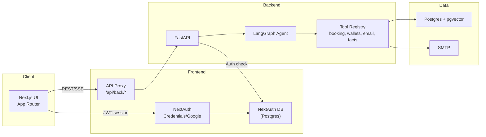
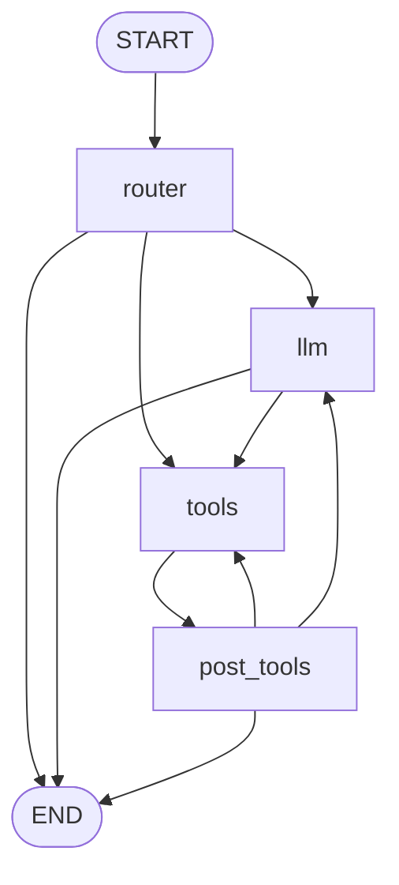

# Architecture Overview

This document summarizes how the Next.js frontend, FastAPI backend, and the agent graph work together.

## High-level system

**Notes**
- Frontend signs a short-lived HS256 JWT (NextAuth secret) and forwards it to the backend proxy calls.
- Backend enforces CORS, UUID validation, and per-owner rate limits (in-memory unless Redis provided).
- SSE endpoints stream agent tokens and UI markers to the frontend.

## Auth flow (owner session)
1) Owner logs in via credentials or Google on NextAuth.
2) NextAuth issues a signed JWT (HS256, `NEXTAUTH_SECRET`) and stores a session in the NextAuth Postgres database.
3) Frontend API proxy attaches the JWT to `/api/back/*` requests.
4) Backend verifies the JWT, resolves owner/user ids, and applies per-owner rate limiting before routing.

# Agent overview

## Request flow (agent_chat.py, graph.py, build.py): 
1. Frontend sends user text -> GET /api/agent/chat
2. agent_chat.py build a LangChain config with relevant metadata (thread_id, user_id, owner_id, timezone, checkpoint_ns)
3. Graph starts at router: 
  - Routes clear intents, can emit tool calls or claritying questions. 
  - If no route matches -> llm with system prompt
4. Llm call model bound with tools, and executes tools at the model's request. 
5. Post_tools reads tool results and can emit confirmations, request additionsl tools, or emit UI markers for the front end. 
6. Streamed SSE events include assistant deltas and any UI markers. 

## Graph wiring

Legend:
- **Router** (rules/regex): routes clear intents; otherwise falls back to LLM.
- **LLM**: tool-bound model (defaults to OpenAI) that can emit tool calls or answers.
- **Tools**: booking, availability, wallets, analytics, email draft/send; all use Postgres/pgvector data.
- **PostTools**: normalizes tool outputs, adds confirmations, and decides whether to loop or end.
- **PENDING_**: waiting for follow up before task completion. 

## Key Files

- Graph plumbing: agent/graph_parts/build.py (conditional edges and loop guards)
- Router (pre‑tool logic): agent/graph_parts/router.py
- Post‑tools (after tool execution): agent/graph_parts/post_tools.py
- Intent patterns/regex: agent/graph_parts/intent_patterns.py
- LLM binding: agent/llm.py (reads AGENT_MODEL → OPENAI_MODEL → default)
- Tool registry: agent/tool_registry.py
- Booking examples: agent/tools_booking.py (identity requirements, conflicts)
- Openings/calendar: agent/tools_calendar.py
- Email/outbox: agent/tool_ops.py (create_email_draft, send_approved_email)

## Data layer
- **Postgres + pgvector**: appointments, availability, clients, wallets, embeddings.
- **Alembic** migrations under `backend/alembic` manage schema.
- **Prisma** (frontend) manages NextAuth tables; keep Prisma and Alembic migrations aligned for shared enums/ids.

## Key env vars (backend)
- Database: `BACKEND_DATABASE_URL`, `RUN_DB_MIGRATIONS`.
- Auth: `AUTH_DISABLED` (dev only), `DEV_FAKE_OWNER_ID` (dev only), `NEXTAUTH_SECRET`.
- Models: `AGENT_MODEL`, `OPENAI_MODEL`, `OPENAI_API_KEY`.
- CORS: `CORS_ALLOWED_ORIGINS`.
- Error detail: `DEV_ERROR_DETAILS` (default 0; flip to 1 only when debugging locally).
- Rate limiting: `RATE_LIMIT_CHAT_PER_MIN`, optional `RATE_LIMIT_REDIS_URL` (leave unset for demo; per-instance memory).
- Email: `SMTP_HOST`, `SMTP_PORT`, `SMTP_USER`, `SMTP_PASS`, `MAIL_FROM`, `ALLOW_AGENT_DIRECT_EMAIL` (keep 0 to require approval).
- Debug: `DEBUG_ENDPOINTS`, `DEV_DEBUG_TOKEN`, `CHAT_THREAD_TTL_DAYS`.
