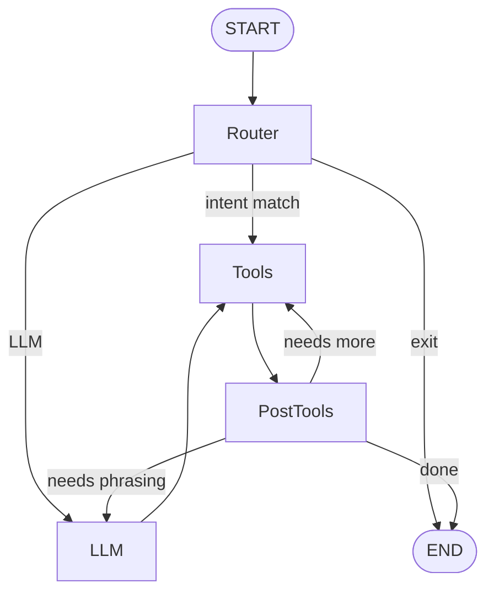

# Architecture Overview

This document summarizes how the Next.js frontend, FastAPI backend, and the agent graph work together.

## High-level system

```mermaid
flowchart LR
  subgraph Client
    UI[Next.js UI<br/>App Router]
  end

  subgraph Frontend
    Proxy[API Proxy<br/>/api/back/*]
    Auth[NextAuth<br/>Credentials/Google]
    DBF[NextAuth DB<br/>(Postgres)]
  end

  subgraph Backend
    API[FastAPI]
    Graph[LangGraph Agent]
    Tools[Tool Registry<br/>booking, wallets, email, facts]
  end

  subgraph Data
    PG[(Postgres + pgvector)]
    SMTP[(SMTP)]
  end

  UI -->|JWT session| Auth
  Auth --> DBF
  UI -->|REST/SSE| Proxy --> API
  API -->|Auth check| DBF
  API --> Graph --> Tools
  Tools --> PG
  Tools --> SMTP
```

**Notes**
- Frontend signs a short-lived HS256 JWT (NextAuth secret) and forwards it to the backend proxy calls.
- Backend enforces CORS, UUID validation, and per-owner rate limits (in-memory unless Redis provided).
- SSE endpoints stream agent tokens and UI markers to the frontend.

## Auth flow (owner session)
1) Owner logs in via credentials or Google on NextAuth.
2) NextAuth issues a signed JWT (HS256, `NEXTAUTH_SECRET`) and stores a session in the NextAuth Postgres database.
3) Frontend API proxy attaches the JWT to `/api/back/*` requests.
4) Backend verifies the JWT, resolves owner/user ids, and applies per-owner rate limiting before routing.

## Agent graph flow (chat)


- **Router** (rules/regex): routes clear intents; otherwise falls back to LLM.
- **LLM**: tool-bound model (defaults to OpenAI) that can emit tool calls or answers.
- **Tools**: booking, availability, wallets, analytics, email draft/send; all use Postgres/pgvector data.
- **PostTools**: normalizes tool outputs, adds confirmations, and decides whether to loop or end.

## Data layer
- **Postgres + pgvector**: appointments, availability, clients, wallets, embeddings.
- **Alembic** migrations under `backend/alembic` manage schema.
- **Prisma** (frontend) manages NextAuth tables; keep Prisma and Alembic migrations aligned for shared enums/ids.
