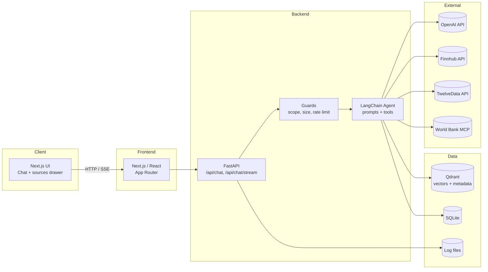
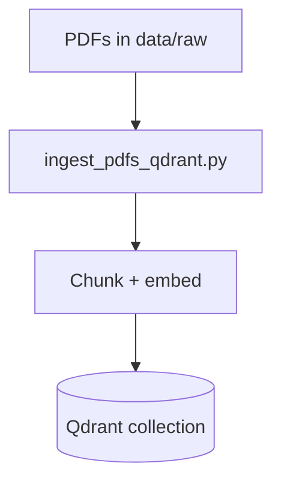

# Architecture Overview

Concise view of how the frontend, backend, vector store, and tools fit together.

## System diagram

## Request flow (chat)
1) Frontend calls `/api/chat` or `/api/chat/stream` with user text and session.
2) Backend guards the request (finance domain, length limits, rate limits).
3) Agent builds a hybrid retriever (Qdrant) + tool list (market data, calculators, World Bank).
4) OpenAI chat model generates with strict citation rails; tools run when invoked.
5) Response streams back with answer, citations, and usage.

## Ingestion flow (docs → Qdrant)

## Environments & secrets
- `.env` holds OpenAI, Finnhub, TwelveData, Qdrant, and MCP settings.
- `.env.local` for frontend base URL.

## Deployment notes
- Frontend: Vercel (Next.js).
- Backend: Cloud Run (FastAPI). Ensure CORS matches frontend domain; keep MCP disabled if not configured.
- Persist Qdrant externally or snapshot/import for consistent vectors across deploys.
